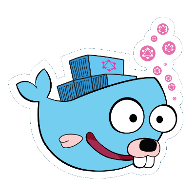

# GraphQL Docker API

[](https://gitlab.com/ulm0/graphql-docker-api/commits/master) [](https://goreportcard.com/report/gitlab.com/ulm0/graphql-docker-api) [](https://microbadger.com/images/ulm0/docker-gql "Get your own version badge on microbadger.com") [](https://microbadger.com/images/ulm0/docker-gql "Get your own image badge on microbadger.com") [](https://hub.docker.com/r/ulm0/docker-gql/) [](LICENSE)



> A GraphQL Server for the Docker API, written in Golang.

## GraphQL Schema

* Schema files can be found [here](resources/schema).
* You can check the query-ready fields in the [TODO list](#todo)

**Note**: It's important to keep this schema synced with the types implemented in the wrapper, best efforts are made in order to keep it so. That being said, You need to know ***this schema is subject to change*** as the time goes by and new changes are introduced in the Docker API and this wrapper as well.

## Getting Started

### Building from source

* Get the package: `go get -d gitlab.com/ulm0/graphql-docker-api/cmd/gdapi`
* Dependencies
  * **Not using [`dep`](README.md#open-source-libraries-and-tools).** Go to the project folder with `cd $GOPATH/src/gitlab.com/ulm0/graphql-docker-api/cmd/gdapi` and `go get -d ./`, this will download the depedencies needed, once that's done build the package with `go build`.
  * **Using [`dep`](README.md#open-source-libraries-and-tools).** Go to the project folder with `cd $GOPATH/src/gitlab.com/ulm0/graphql-docker-api`, and run `dep ensure`, now get to `$GOPATH/src/gitlab.com/ulm0/graphql-docker-api/cmd/gdapi` and build the package with `go build`.

**That's pretty much it. Congrats You have GraphQL Docker API on your system now.**

### Docker image

#### Local socket

```sh
docker run -d \
--name docker-gql \
-p 8080:8080 \
-e API_ENDPOINT="/api" \
-v /var/run/docker.sock:/var/run/docker.sock \
ulm0/docker-gql
```

**Note**: The `-v /var/run/docker.sock:/var/run/docker.sock` option can be used in Linux environments only.

#### Remote host

##### HTTP

```sh
docker run -d \
--name docker-gql \
-p 8080:8080 \
-e API_ENDPOINT="/api" \
-e DOCKER_HOST="http://<host>:<port>" \
ulm0/docker-gql
```

##### HTTPS

```sh
docker run -d \
--name docker-gql \
-p 8080:8080 \
-e API_ENDPOINT="/api" \
-e DOCKER_HOST="https://<host>:<port>" \
-v /path/to/folder/containing/the/docker/certs:/etc/docker \
ulm0/docker-gql
```

## Environment variables

* `DOCKER_CERT_PATH`: When using safe connection to Docker Remote API.
* `DOCKER_HOST`: Host the API will retrieve information from (default: `"/var/run/docker.sock"`).
* `GQL_PORT`: Port the API will listen on (default: `":8080"`).
* `GRAPHIQL`: It's enabled by default, `GRAPHIQL=0` must be set in order to disable it.
* `API_ENDPOINT`: Endpoint for the API (default: `"/graphql"`).

### Notes

* If using a Docker Remote API, this must be specified with the either HTTP or HTTPS protocols (e.g,: `DOCKER_HOST="http://<host>:<port>"`).
* When using HTTPS, the TLS certs must be placed in `/etc/docker` or the `/path/to/folder/containing/the/docker/certs` must be mounted under `/etc/docker` inside the running container, and must follow the semantics behind the [DOCKER_CERT_PATH](https://docs.docker.com/engine/security/https/#create-a-ca-server-and-client-keys-with-openssl) env var.
* `GRAPHIQL` can be reached at the `API_ENDPOINT`; disabling is advised when using in production, you can do so by setting `GRAPHIQL=0`.

## TODO

* [ ] GraphQL Queries
    * [ ] Map to endpoints of the Docker API
      * [ ] Containers
      * [ ] Images
      * [ ] Swarm
          * [ ] Services
          * [ ] Stacks
      * [x] [System](resources/schema/system.graphql)
      * [ ] Volumes
      * [ ] Secrets
      * [ ] Tasks
* [ ] GraphQL Mutations
* [ ] GraphQL Subscriptions if possible, especially for Docker events
* [ ] GraphQL Descriptions
* [ ] Authentication / Authorization
* [ ] Makefile for local build
    * [ ] Binary
    * [ ] Docker image
* [x] CI integration
* [x] Build from source how-to
* [x] Docker image how-to
    * [ ] Multiarch support using [manifest-tool](https://github.com/estesp/manifest-tool)

## Open-Source libraries and tools

* [docker/client](https://github.com/moby/moby/tree/master/client)
* [golang/dep](https://github.com/golang/dep)
* [gorilla/mux](https://github.com/gorilla/mux)
* [neelance/graphql-go](https://gitlab.com/ulm0/graphql-go)
* [urfave/negroni](https://github.com/urfave/negroni)

---
[](https://forthebadge.com) [](https://forthebadge.com)